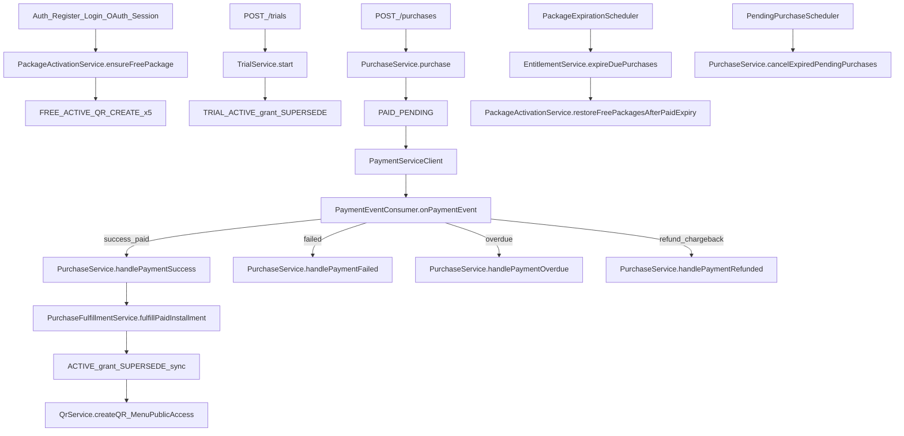

# Paket Sat?n Alma ve Sonras? Ak?? Dok?mantasyonu

Bu dok?man `algoryqr-service` i?inde paket sat?n alma, trial, free paket, ?deme event?leri, entitlement t?ketimi ve dijital men? public eri?im kurallar?n? endpoint / s?n?f / metot seviyesinde anlat?r.

---

## 1. Kavramlar ve enum?lar

| Enum | De?erler | Dosya |
|------|----------|--------|
| `PurchaseStatus` | `PENDING`, `ACTIVE`, `FAILED`, `EXPIRED`, `CANCELLED`, `SUPERSEDED` | `model/enums/PurchaseStatus.java` |
| `PurchaseType` | `FREE`, `TRIAL`, `PAID`, `SYSTEM_GRANT` | `model/enums/PurchaseType.java` |
| `PaymentMode` | `DIRECT`, `THREE_DS`, `CHECKOUT_FORM` | `model/enums/PaymentMode.java` |
| `PaymentStyle` | `ONE_TIME`, `BANK_INSTALLMENT`, `SUBSCRIPTION` | `model/enums/PaymentStyle.java` |
| `FulfillmentStatus` | `PENDING`, `PAID`, `FAILED`, `OVERDUE`, `REVOKED` | `model/enums/FulfillmentStatus.java` |
| `PurchaseCancellationReason` | `PAYMENT_TIMEOUT`, `MANUAL` | `model/enums/PurchaseCancellationReason.java` |
| `RefundStatus` | `NONE`, `PENDING`, `COMPLETED`, `NEEDS_RECONCILE` | `model/enums/RefundStatus.java` |
| `MenuPublicAccessDisabledReason` | `PACKAGE_INACTIVE`, `INSTALLMENT_OVERDUE` | `model/enums/MenuPublicAccessDisabledReason.java` |

### Kullan?labilirlik kurallar?

| Nesne | Metot | Kural |
|-------|--------|--------|
| `Purchase` | `isUsable()` | `status == ACTIVE` **ve** `expiresAt` ge?mi? de?il |
| `UserEntitlement` | `isUsable(PurchaseStatus)` | purchase `ACTIVE` + entitlement tarihi dolmam?? + (`unlimited` **veya** `remainingQuantity > 0`) |
| `EntitlementService` | `hasUsableQrCreatePackage(userId)` | `QR_CREATE` entitlement sat?r? var **ve** purchase `isUsable()` ? **remaining yok say?l?r** |

### Katalog sabitleri

| Sabit | De?er | Dosya |
|-------|--------|--------|
| `CatalogPackages.STARTER_PACKAGE` | Başlangıç paket kodu | `catalog/CatalogPackages.java` |
| `CatalogPackages.PRO_PACKAGE` | Pro paket kodu | `catalog/CatalogPackages.java` |
| `CatalogPackages.ULTIMATE_PACKAGE` | Ultimate paket kodu | `catalog/CatalogPackages.java` |
| `CatalogProducts.QR_CREATE` | QR olusturma hakki | `catalog/CatalogProducts.java` |
| `CatalogProducts.QR_MENU` | Dijital menu hakki | `catalog/CatalogProducts.java` |
| `CatalogProducts.MENU_PRODUCT` | Menu urun hakki | `catalog/CatalogProducts.java` |
| `CatalogProducts.SMART_ASSISTANT` | Akilli Asistan | `catalog/CatalogProducts.java` |
| `CatalogProducts.SMART_SUMMARY` | Akilli Ozet | `catalog/CatalogProducts.java` |
| `CatalogProducts.SMART_REPORTING` | Akilli Raporlama | `catalog/CatalogProducts.java` |
| `CatalogProducts.CUSTOM_DESIGN` | Ozel tasarim menu | `catalog/CatalogProducts.java` |
| `CatalogProducts.WAITER_PANEL` | Garson paneli (Ultimate) | `catalog/CatalogProducts.java` |
| `CatalogScopes.QR_CREATE_OWNER` | Scope: QR create / menu public gate | `catalog/CatalogScopes.java` |
| `CatalogScopes.QR_MENU_OWNER` | Scope: Dijital menu (feedback, rezervasyon) | `catalog/CatalogScopes.java` |
| `CatalogScopes.WAITER_PANEL_OWNER` | Scope: Garson paneli, masa, siparis, musteri | `catalog/CatalogScopes.java` |
| `CatalogScopes.MENU_PRODUCT_OWNER` | Scope: Menu urun limiti | `catalog/CatalogScopes.java` |
| `CatalogScopes.SMART_ASSISTANT_OWNER` | Scope: Akilli Asistan | `catalog/CatalogScopes.java` |
| `CatalogScopes.SMART_SUMMARY_OWNER` | Scope: Akilli Ozet | `catalog/CatalogScopes.java` |
| `CatalogScopes.SMART_REPORTING_OWNER` | Scope: Akilli Raporlama | `catalog/CatalogScopes.java` |
| `CatalogScopes.CUSTOM_DESIGN_OWNER` | Scope: Ozel tema / tasarim | `catalog/CatalogScopes.java` |

Abonelik durumu (`PackageActivationService.ensureSubscriptionState`):

- Kayıt/giriş/expiry sonrası yalnızca aktif TRIAL/PAID purchase senkronize edilir
- Free paket otomatik verilmez; paketsiz kullanıcı entitlement almaz

---

## 2. ?lgili HTTP endpoint?ler

### Paket katalog

| Method | Path | Controller | Service |
|--------|------|------------|---------|
| `GET` | `/packages` | `PackageController` | paket listesi |
| `GET` | `/packages/{id}` | `PackageController` | paket detay |

### Sat?n alma

| Method | Path | Controller metodu | Service |
|--------|------|-------------------|---------|
| `POST` | `/purchases` | `PurchaseController.purchase` | `PurchaseService.purchase` |
| `GET` | `/purchases/my` | `getMyPurchases` | `PurchaseService.getUserPurchases` |
| `GET` | `/purchases/my/logs` | `getMyPurchaseLogs` | `PurchaseLogService.getUserLogs` |
| `GET` | `/purchases/my/entitlements` | `getMyEntitlements` | `EntitlementService.getUserEntitlements` |
| `GET` | `/purchases/{purchaseId}/summary` | `getPurchaseSummary` | `PurchaseService.getPurchaseSummary` |
| `POST` | `/purchases/{purchaseId}/cancel` | `cancelMyPurchase` | `PurchaseService.cancelMyPurchase` |
| `POST` | `/purchases/{purchaseId}/cancel-at-period-end` | `cancelAtPeriodEnd` | `PurchaseService.cancelAtPeriodEnd` |
| `POST` | `/purchases/{purchaseId}/resume-renewal` | `resumeRenewal` | `PurchaseService.resumeRenewal` |
| `POST` | `/purchases/{purchaseId}/cancel-with-refund` | `cancelWithRefund` | `PurchaseService.cancelWithRefund` |
| `GET` | `/purchases/{purchaseId}/installments` | `getPurchaseInstallments` | `PurchaseService.getPurchaseInstallments` |
| `GET` | `/purchases/{purchaseId}/logs` | `getPurchaseLogs` | `PurchaseLogService.getPurchaseLogs` |

### Trial

| Method | Path | Controller | Service |
|--------|------|------------|---------|
| `POST` | `/trials` | `TrialController.start` | `TrialService.start` |
| `POST` | `/trials/digital-menu-pro` | `TrialController.startLegacy` | `TrialService.startDigitalMenuPro` (PRO only) |
| `GET` | `/trials/status` | `TrialController.status` | `TrialService.status` |
| `GET` | `/trials/digital-menu-pro/status` | `TrialController.statusLegacy` | `TrialService.status` |
| `GET` | `/trials/eligible-packages` | `TrialController.eligiblePackages` | `TrialService.listEligiblePackages` |

### Admin

| Method | Path | Controller | Service |
|--------|------|------------|---------|
| `POST` | `/admin/purchases/{purchaseId}/expire` | `AdminPurchaseController` | `PurchaseService.expirePurchase` |
| `GET` | `/admin/purchases/{purchaseId}/summary` | `AdminPurchaseController` | `PurchaseService.getPurchaseSummaryAdmin` |

### Billing (?deme yard?mc?lar?)

| Method | Path | Controller |
|--------|------|------------|
| `GET` | `/billing/payment-methods` | `BillingPaymentController` |
| `POST` | `/billing/payment-methods` | `BillingPaymentController` |
| `DELETE` | `/billing/payment-methods/{paymentMethodId}` | `BillingPaymentController` |
| `GET` | `/billing/installment-options` | `BillingPaymentController` |
| `GET` | `/billing/subscriptions` | `BillingPaymentController` |
| `POST` | `/billing/subscriptions/{subscriptionId}/cancel` | `BillingPaymentController` |

### QR / men? (hak t?ketimi ve public gate)

| Method | Path | Controller | Not |
|--------|------|------------|-----|
| `POST` | `/qr/create` | `QrController` ? `QrService.createQR` | Scope + consume; menu için `QR_MENU` kotası |
| `PUT` | `/qr/update/{qrId}` | `QrService.updateQr` | Soft-delete + yeniden create |
| `DELETE` | `/qr/delete/{qrId}` | `QrService.deleteQrByQrId` | QR + ba?l? Menu soft-delete |
| `GET` | `/menu/public/id/{qrId}` | `MenuController` ? `MenuService.getPublicMenuByQrId` | Public gate |
| Owner menu CRUD | `/menu/**` | authenticated (product scope yok) | ownership checks in service |
| Garson paneli (merchant) | `/waiter-panel/**` | `@RequiresProductScope(WAITER_PANEL_OWNER)` | Ultimate paket gerekir |
| Garson mobil auth | `/waiter/auth/**` | `ROLE_WAITER` | owner'da `WAITER_PANEL_OWNER` olmali |
| Garson mobil siparis | `/waiter/orders/**` | `ROLE_WAITER` | ayri controller |
| Public siparis | `/menu/public/**/orders/**` | scope yok | musteri tarafi |

---

## 3. Genel ak?? diyagram?

---

## 4. Yol A ? Free paket (baseline)

### Kurallar

- Her kullan?c?n?n **mutlaka bir Free purchase kayd?** olur (`PurchaseType.FREE`).
- Free?nin limitleri vard?r (katalog `items`; varsay?lan 5? `QR_CREATE`).
- Pro / Ultimate / Trial usable iken UI ve access profile **?cretli/trial paketi** g?sterir; Free `SUPERSEDED` olarak durur (silinmez).
- ?cretli/trial bitince veya iptal edilince Free yeniden `ACTIVE` olur; haklar `EntitlementService.refreshForPackage` ile yenilenir.

### Tetikleyiciler

`PackageActivationService.ensureFreePackage(userId)` ?u ak??lardan ?a?r?l?r:

- Auth kay?t / giri? (`AuthService`)
- Session (`SessionService`)
- Google OAuth (`GoogleOAuthUserService`)
- Access profile resolve (`UserAccessProfileService`)
- Expire scheduler (`ensureFreeForUsers` + `restoreFreePackagesAfterPaidExpiry`)
- ?ptal / expire / refund sonras?

### Metot zinciri

1. S?resi dolan ACTIVE purchase?lar expire edilir.
2. Usable **non-Free** varsa ? en y?ksek `priority` d?ner; Free baseline `SUPERSEDED` tutulur/olu?turulur.
3. Usable non-Free yoksa ? mevcut Free `ACTIVE` yap?l?r (yoksa olu?turulur) + entitlement refresh + men? sync.

---

## 5. Yol B — Trial

### Endpoint

`POST /trials` → `TrialController` → `TrialService.start(userId, packageId)`

Legacy: `POST /trials/digital-menu-pro` → `TrialService.startDigitalMenuPro(userId)` (yalnızca `PRO_PACKAGE`)

Durum sorgusu: `GET /trials/status` / `GET /trials/digital-menu-pro/status` → `TrialService.status(userId)`

### Metot zinciri (`start` / `startDigitalMenuPro`)

1. `user.trialUsed` veya daha önce `PurchaseType.TRIAL` var mı? Varsa reddet (tek sefer)
2. Aktif usable `PAID` varken reddet
3. Paket: `active && trialEligible && !systemManaged` + geçerli `trialDays` (legacy: sabit `PRO_PACKAGE`)
4. `Purchase` oluşturulur:
   - `purchaseType=TRIAL`
   - `status=ACTIVE` (hemen)
   - fiyat 0
   - `expiresAt = now + package.trialDays`
5. `PackageActivationService.activatePurchasedPackage(purchase)` — diğer `ACTIVE` purchase’lar `SUPERSEDED`
6. Paket item’ları için `EntitlementService.grant(...)`

### Sınırlar

- Kullanıcı başına **tek** trial (`uk_purchase_trial_user` + `trial_used`)
- Seed: yalnızca Pro `trialEligible`; Ultimate deneme dışı
- Ödeme client’ı çağrılmaz
- `expiresAt` sonrası haklar usable değildir; expire path Free’yi aynı işlemde restore eder + menu sync
- `TrialExpiryReminderScheduler` — süresi yaklaşan ACTIVE trial için hatırlatma
- `TrialService.status` okumada süresi dolmuş trial’ı expire eder; TRIAL varken `trialUsed` backfill edilir

---

## 6. Yol C ? ?cretli sat?n alma

### Endpoint

`POST /purchases` ? `PurchaseController.purchase` ? `PurchaseService.purchase(user, request, clientIp)`

### ?n kontroller (`PurchaseService.purchase`)

1. `PlanPackageService.findActivePackage(packageId)` ? paket aktif + item?l?
2. Red:
   - `!purchasable`
   - `systemManaged`
   - paket kodu `FREE_PACKAGE`
3. `PurchaseRequest.isPaymentPlanValid()`:
   - ?zinli taksit say?lar?: 1, 2, 3, 6, 9, 12
   - `ONE_TIME` ? count = 1
   - `BANK_INSTALLMENT` ? count > 1
   - `SUBSCRIPTION` ? izinli count?lardan biri
   - `paymentStyle` yoksa: count > 1 ? `BANK_INSTALLMENT`, aksi halde `ONE_TIME`
4. Billing kayna??: id / inline / legacy adresten tam biri
5. Kart veya `paymentMethodId` zorunlu

### Purchase olu?turma

1. `Purchase` kayd?:
   - `purchaseType=PAID`
   - `status=PENDING`
   - billing snapshot, payment style/count
2. `PaymentRequestMapper.buildConversationId(purchaseId)`
3. `paymentStyle == SUBSCRIPTION` ise:
   - `PurchaseFulfillmentService.initializeSchedule(purchase, serviceName)` ? PENDING fulfillment sat?rlar?
4. ?deme ?a?r?s?:
   - `PaymentMode.DIRECT` ? `PaymentServiceClient.createDirectPayment`
   - aksi halde ? `PaymentServiceClient.initializeThreeDsPayment`
5. Client hata ? purchase `FAILED` + log `PURCHASE_PAYMENT_FAILED`
6. Response: `PurchaseInitiateResponse` (3DS URL / payment sonucu)

### Pending timeout + reconcile

`PendingPurchaseScheduler` (`fixedRate = 300_000` ms / 5 dk):

1. **Reconcile:** `PENDING` + `paymentConversationId` dolu + en az 2 dk eski kayitlar icin payment-service `GET /payments/{conversationId}` sorgulanir. Status `SUCCESS` ise Rabbit event beklenmeden `handlePaymentSuccess` ile paket aktive edilir (`eventId=reconcile:{conversationId}:1`).
2. **Timeout cancel:** `PurchaseService.cancelExpiredPendingPurchases(timeoutMinutes)` ? default genelde **30 dakika**. Iptal oncesi yine payment SUCCESS kontrolu yapilir; odeme basariliysa iptal yerine aktivasyon.
3. Gercekten odenmemis `PENDING` ? `CANCELLED` + `cancellationReason=PAYMENT_TIMEOUT`

---

## 7. Odeme eventleri (RabbitMQ)

HTTP webhook yok. Tamamlama kuyruk uzerinden gelir.

Wire format, headers ve alan semasi: [`docs/payment-events-contract.md`](payment-events-contract.md).

### Consumer

- Sinif: `com.ael.algoryqrservice.messaging.payment.PaymentEventConsumer`
- Metot: `onPaymentEvent(Message)` → schema-first JSON → `PaymentCompletedEventDto` → handler registry
- Queue: `payment.rabbitmq.events-queue` (`PaymentRabbitMqProperties.eventsQueue`)

### Event → handler tablosu

| `eventType` | Handler |
|-------------|---------|
| `payment.success` | `PurchaseService.handlePaymentSuccess` |
| `payment.installment.paid` | `handlePaymentSuccess` |
| `payment.subscription.paid` | `handlePaymentSuccess` |
| `payment.failed` | `handlePaymentFailed` |
| `payment.installment.failed` | `handlePaymentFailed` |
| `payment.subscription.failed` | `handlePaymentFailed` |
| `payment.subscription.past_due` | `handlePaymentFailed` |
| `payment.installment.overdue` | `handlePaymentOverdue` |
| `payment.refunded` | `handlePaymentRefunded` |
| `payment.chargeback` | `handlePaymentRefunded` |
| `subscription.cancelled_at_period_end` | `handleSubscriptionCancelledAtPeriodEnd` |
| diger | `InvalidPaymentEventException` → reject, requeue yok |

### Ortak dogrulamalar (`PurchaseService`)

- Inbox idempotency: `PaymentEventInbox` / `eventId`
- `validateIdentity(...)`: serviceName, conversationId, currency, userId/packageId/packageCode/purchaseId
- Success icin `validatePaidEvent(...)`: taksit no/count, tutar, periodStart/periodEnd

---

## 8. Fulfillment ve status ge?i?leri

### Ba?ar?: `PurchaseService.handlePaymentSuccess` ? `PurchaseFulfillmentService.fulfillPaidInstallment`

1. `(purchaseId, installmentId)` fulfillment upsert; zaten `PAID` ise no-op
2. Access window: event period s?resi kadar `expiresAt` uzat?l?r (`max(now, currentExpiresAt)` baz al?narak)
3. **?lk ?denen taksit:**
   - `startsAt` set
   - `status = ACTIVE`
   - `grantEntitlements(purchase, planPackage)` ? her paket item i?in `EntitlementService.grant`
   - `PackageActivationService.activatePurchasedPackage` ? di?er ACTIVE ? `SUPERSEDED`
4. Her success?te:
   - `status = ACTIVE`
   - `cancellationReason` temizlenir
   - `EntitlementService.synchronizePeriod(purchase)`
   - `MenuPublicAccessService.syncForUser(userId)`
   - log `PURCHASE_COMPLETED`

**Timeout iptali ?zel kural?:** `CANCELLED` + `PAYMENT_TIMEOUT` iken success gelirse fulfill edilebilir. Di?er cancel nedenlerinde success reddedilir.

### Ba?ar?s?z: `handlePaymentFailed`

- Status zaten `ACTIVE` / `SUPERSEDED` / `EXPIRED` ? event i?lenmi? say?l?r, ignore
- `PENDING` ? `FAILED`
- `recordUnpaidInstallment(..., FAILED)` ? ACTIVE purchase?? d???rmez

### Overdue: `handlePaymentOverdue`

- `recordUnpaidInstallment(..., OVERDUE)`
- `MenuPublicAccessService.syncForUser` ? public men? kapanabilir (`INSTALLMENT_OVERDUE`)

### Refund / chargeback: `handlePaymentRefunded`

- Fulfillment → `REVOKED` (purchase `CANCELLED` olsa bile; early-return yok)
- `recalculatePaidPeriod(purchase)`:
  - odenen kalmadi → purchase `EXPIRED`, free ensure, sync
  - kaldi → `expiresAt` yeniden hesaplanir; gerekirse free restore + sync
- Purchase `CANCELLED` veya `EXPIRED` ise ek side-effect:
  - `refundedAt` / `refundStatus=COMPLETED` (yoksa)
  - entitlement revoke + menu deactivate
  - remote subscription cancel (best-effort; fail → `NEEDS_RECONCILE`)

### Kullanici iptal / iade

| Endpoint | Kim | Davranis |
|----------|-----|----------|
| `POST /purchases/{id}/cancel` | Trial, PENDING, ONE_TIME / BANK_INSTALLMENT paid | Aninda `CANCELLED`; **para iadesi yok**. Paid ACTIVE `SUBSCRIPTION` reddedilir. |
| `POST /purchases/{id}/cancel-at-period-end` | Paid ACTIVE subscription | `cancelAtPeriodEnd=true`; erisim `expiresAt` kadar surer |
| `POST /purchases/{id}/resume-renewal` | Paid ACTIVE subscription | Donem sonu iptal bayragini kaldirir |
| `POST /purchases/{id}/cancel-with-refund` | Paid ACTIVE subscription, cooling window icinde | Saga: `PENDING` → gateway refund → local `CANCELLED` |

**ONE_TIME / BANK_INSTALLMENT politikasi:** Kullanici iade API'si yoktur. `/cancel` yalnizca erisimi keser; odeme iadesi yapilmaz. Iade yalnizca paid `SUBSCRIPTION` + soğuma penceresi (`billing.refund.monthly-cooling-days` / `yearly-cooling-days`) ile `/cancel-with-refund` uzerinden.

**Refund saga guvenilirlik:**
- `RefundStatus.PENDING` iken yeni iade baslatilamaz
- Gateway iade basarili, lokal tamamlanamadi → `RefundReconcileScheduler` `getRefundablePayment` ile `remaining==0` ise local cancel tamamlar
- Stuck `PENDING` (`refund_pending_at` + `pending-stuck-minutes`) ve odeme tarafinda hala bakiye varsa → `NONE`e rollback
- Remote subscription cancel fail (iade sonrasi) → `NEEDS_RECONCILE` + scheduler retry

### Admin expire

`POST /admin/purchases/{id}/expire` ? `PurchaseService.expirePurchase`

- Zaten `EXPIRED` / `CANCELLED` / `PENDING` / `FAILED` ise engellenir
- Aksi halde `EntitlementService.expirePurchase` ? free ensure ? sync

### Expire scheduler

`PackageExpirationScheduler` (`fixedRate = 300_000`):

1. `ACTIVE` ve `expiresAt < now` bul
2. `EntitlementService.expireDuePurchases()` ? `EXPIRED` + log + sync
3. `PackageActivationService.restoreFreePackagesAfterPaidExpiry()`
4. ?lgili user?lar i?in ek sync

`EntitlementService.consume` / `hasUsableQrCreatePackage` i?inde de opportunistic `expireDuePurchases()` ?a?r?l?r.

---

## 9. Entitlement grant / consume / scope

### Grant

`EntitlementService.grant(purchase, productId, productCode, quantity, unlimited)`

- Ayn? purchase + product i?in tekrar grant edilmez (idempotent)
- `totalQuantity` / `remainingQuantity` set edilir
- Log: `ENTITLEMENT_GRANTED`

### Consume

`EntitlementService.consume(userId, productCode, amount)`

1. `expireDuePurchases()`
2. ?r?n consumable de?ilse ? sadece `requireScope`
3. Consumable ise usable entitlement?lardan FIFO d???m
4. Yetersiz hak ? `ForbiddenException` (?Yetersiz veya s?resi dolmu? ? hakk??)

### Scope

- `hasScope(userId, scopeCode)` ? usable entitlement + product.scopeCode e?le?mesi
- `requireScope` ? yoksa `ForbiddenException`
- Owner men? API: authenticated (product scope yok; auth yeterli)
- Garson paneli merchant API (`WaiterPanelController`): class-level `WAITER_PANEL_OWNER` zorunlu; yalnizca Ultimate pakette grant edilir
- Garson login (`MenuWaiterAuthService.login`): menu sahibinin `WAITER_PANEL_OWNER` scope'u yoksa 403

---

## 10. QR create kurallar? (hak + tek aktif men?)

### Endpoint

`POST /qr/create` ? `QrController` ? `QrService.createQR(req, userId)`

### Metot s?ras?

1. `entitlementService.requireScope(userId, QR_CREATE_OWNER)`
2. Tip `MENU` ise:
   1. `requireScope(QR_MENU_OWNER)`
   2. `consume(QR_MENU, 1)` — kalan 0 ise **403 Forbidden**
   3. `consume(QR_CREATE, 1)`
3. `QrProviderFactory.get(type, ...).createQr(req)`
4. Menu tipi için `MenuProvider` → `MenuService.createMenuForQr` → `MenuPublicAccessService.syncForUser`

Menü QR silindiğinde `softDeleteQrAndLinkedMenu` → `release(QR_MENU, 1)` ile slot geri verilir.

### Aktif canl? menu QR tan?m? (`existsActiveLiveMenuQrForUser`)

- `Menu.userId = userId`
- `Menu.active = true`
- `Menu.deleted = false`
- Ba?l? `Qr.deleted = false`

### QR silme / update

`QrService.softDeleteQrAndLinkedMenu(qr)`:

- QR `deleted=true`
- Bağlı menu: `deleted=true`, `active=false`
- Menü QR ise: `release(QR_MENU, 1)`

?a?r?ld??? yerler:

- `deleteQrByQrId`
- `updateQr` (yeniden create ?ncesi)

---

## 11. Public men? eri?im kap?s?

### Endpoint?ler

- `GET /menu/public/id/{qrId}` ? `MenuService.getPublicMenuByQrId`
- ?�eride: `buildPublicResponse(menu)`

### Runtime kontroller (`buildPublicResponse`)

1. `menu.active == false` ? **404** `"Men? yay?nda de?il"`
2. `menu.publicAccessEnabled == false` ? **403** `ForbiddenException` (`MENU_OWNER_PACKAGE_INACTIVE`)  
   Mesaj: restoran sahibiyle ileti?ime ge?in

### Sync de?erlendirmesi (`MenuPublicAccessService.evaluate`)

1. `entitlementService.hasScope(userId, QR_CREATE_OWNER)` yoksa ? deny `PACKAGE_INACTIVE`
2. Usable `ACTIVE` purchase yoksa ? deny `PACKAGE_INACTIVE`
3. Bu purchase?lardan herhangi birinde fulfillment `OVERDUE` varsa ? deny `INSTALLMENT_OVERDUE`
4. Aksi halde allow

`syncForUser` sonucu `Menu.publicAccessEnabled` + `publicAccessDisabledReason` kolonlar?na yaz?l?r (`MenuRepository.updatePublicAccessByUserId`).

### Sync tetikleyicileri

| Tetikleyici | Yer |
|-------------|-----|
| Free paket create | `PackageActivationService.ensureFreePackage` |
| ?deme fulfill | `PurchaseFulfillmentService.fulfillPaidInstallment` |
| Overdue | `recordUnpaidInstallment` (OVERDUE) |
| Refund recalculate | `recalculatePaidPeriod` |
| Purchase expire | `EntitlementService.expirePurchaseInternal` |
| Admin expire | `PurchaseService.expirePurchase` |
| Paid expiry restore | `restoreFreePackagesAfterPaidExpiry` |
| Expire scheduler | `PackageExpirationScheduler.expirePackages` |
| Menu create | `MenuService.createMenuForQr` |
| Startup backfill | `MenuPublicAccessBackfillRunner` ? `syncAllMenuOwners` |

---

## 12. S?n?r / karar matrisi

| Durum | Normal QR | Menu QR | Owner menu API | Public menu |
|--------|-----------|---------|----------------|-------------|
| Free ACTIVE (`QR_CREATE` kalan) | Evet | `QR_MENU` yok → scope/consume fail | Evet (auth) | Sync true ise |
| Trial / Paid ACTIVE + `QR_MENU` kalan > 0 | Evet (kota) | Evet (kota) | Evet (auth) | Sync true ise |
| Trial / Paid ACTIVE + `QR_MENU` kalan = 0 | Evet (kota) | **403** | Evet (auth) | Sync true ise |
| Purchase EXPIRED / CANCELLED (ACTIVE yok) | Free kurallari | Hayir | Evet (auth) | Hayir |
| Installment OVERDUE | Entitlement kalabilir | ? | Evet (auth) | **Hayir** |
| PENDING purchase | Henuz grant yok | Hayir | Evet (auth) | Hayir |
| Payment success after `PAYMENT_TIMEOUT` cancel | Fulfill edilebilir | ? | ? | Sync sonrasi |
| `FREE_PACKAGE` / systemManaged sat?n alma | ? | ? | ? | API reddeder |
| ?kinci trial | ? | ? | ? | Red |

---

## 13. Ana s?n?flar (h?zl? indeks)

| Katman | S?n?f |
|--------|--------|
| Controllers | `PurchaseController`, `TrialController`, `PackageController`, `QrController`, `MenuController`, `AdminPurchaseController`, `BillingPaymentController` |
| Purchase core | `PurchaseService`, `PurchaseFulfillmentService`, `PurchaseLogService` |
| Packages | `PackageActivationService`, `PackageCatalogService`, `PlanPackageService` |
| Entitlements | `EntitlementService` |
| Trial | `TrialService`, `TrialExpiryReminderScheduler`, `TrialExpiryReminderDispatcher` |
| Payment IO | `PaymentServiceClient`, `PaymentRequestMapper`, `PaymentEventConsumer` |
| Schedulers | `PendingPurchaseScheduler`, `PackageExpirationScheduler`, `RefundReconcileScheduler` |
| Menu access | `MenuPublicAccessService`, `MenuPublicAccessBackfillRunner` |
| QR gate | `QrService`, `MenuRepository.existsActiveLiveMenuQrForUser` |
| Aspect | `ProductScopeAspect` (`@RequiresProductScope`) |

---

## 14. Tipik senaryolar

### Senaryo 1 ? Yeni kullan?c?

1. `POST /auth/register` ? `ensureFreePackage`
2. `POST /qr/create` (link) ? `QR_CREATE` consume
3. Menu owner API auth ile acilir (ayri QR_MENU scope yok)

### Senaryo 2 ? Trial ba?lat?p men? a?ma

1. `POST /trials` (veya legacy `POST /trials/digital-menu-pro`) → TRIAL ACTIVE + grant (`trialDays`)
2. `POST /qr/create` type=`menu` → `consume(QR_MENU, 1)` + `consume(QR_CREATE, 1)` → `createMenuForQr` → sync
3. Ek menü: `QR_MENU remainingQuantity > 0` olduğu sürece tekrar create edilebilir; kalan 0 ise 403
4. Menü silinince `release(QR_MENU, 1)` ile slot açılır

### Senaryo 3 ? ?cretli 3DS

1. `POST /purchases` ? PENDING + 3DS URL
2. Kullan?c? ?der ? Rabbit `payment.success`
3. `handlePaymentSuccess` ? `fulfillPaidInstallment` ? ACTIVE + grant + SUPERSEDE free + sync
4. Owner men? API ve public men? a??l?r (scope + sync OK)

### Senaryo 4 ? Taksit gecikmesi

1. `payment.installment.overdue`
2. Fulfillment `OVERDUE` + sync
3. Public `GET /menu/public/...` ? 403
4. Owner paneli scope?a g?re de?i?ebilir; public kapal? kal?r

### Senaryo 5 ? S?re dolumu

1. `PackageExpirationScheduler` ? `expireDuePurchases`
2. Paid/trial EXPIRED ? sync ? `restoreFreePackagesAfterPaidExpiry`
3. Kullan?c? tekrar free kota ile s?n?rl?

---

## 15. Bak?m notlar?

- Public eri?im **son sync** flag?ine bakar; her request?te `evaluate` yeniden ?al??t?r?lmaz.
- `UserEntitlement.isUsable` remaining bitince scope false olabilir; buna kar??l?k ?aktif menu var m??? kontrol? `hasUsableQrCreatePackage` ile remaining?i yok sayar.
- QR silinmeden Menu soft-delete yap?lmazsa orphan aktif menu create?i yanl??l?kla bloklayabilir; `softDeleteQrAndLinkedMenu` bunu ?nler.
- ?deme tamamlamas? yaln?zca RabbitMQ event?leri ile yap?l?r; bu serviste payment webhook controller yoktur.
