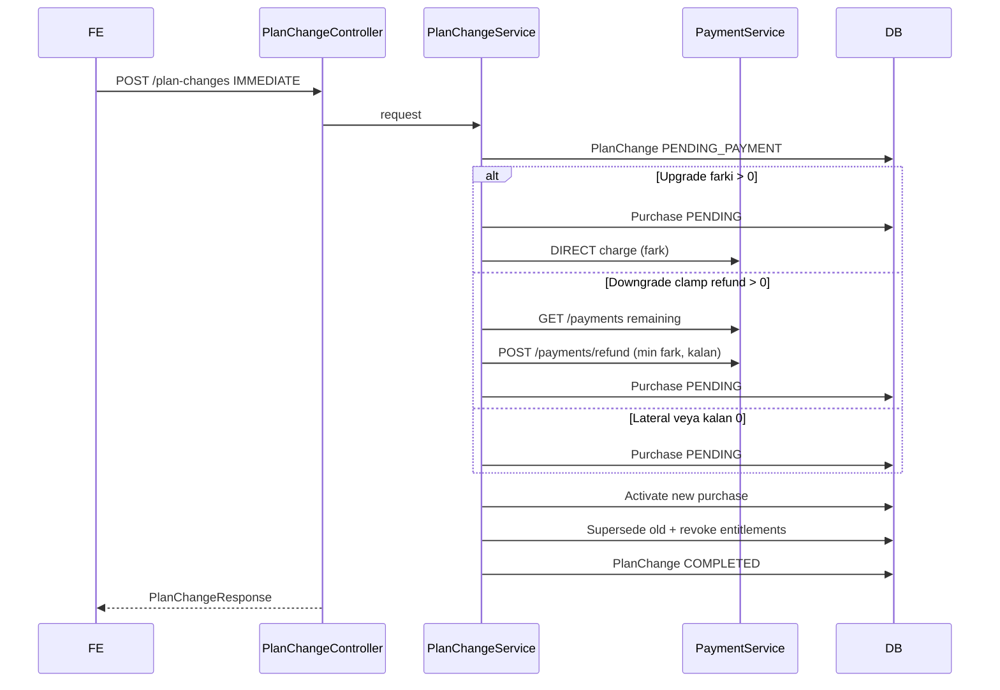

# Paket Upgrade / Downgrade (Plan Change)

## Ozet

Aktif ucretli paketler arasinda gecis:

- **IMMEDIATE UPGRADE**: kayitli karttan `max(0, to.price - fromPurchase.price)` farki cekilir; eski haklar sifirlanir; yeni paket haklari tanimlanir.
- **IMMEDIATE DOWNGRADE**: katalog farki `max(0, fromPurchase.price - to.price)`; gercek iade `min(katalogFarki, payment kalan bakiye)` (iyzico refund). Kalan 0 ise iade yok, paket yine degisir.
- **IMMEDIATE LATERAL**: para hareketi yok; haklar sifirdan tanimlanir.
- **NEXT_PERIOD**: mevcut `expiresAt` tarihine kadar eski paket devam eder; tarihte hedef paket **tam fiyati** tahsil edilip aktive edilir.

`purchase.price` katalog/donem fiyati olarak kalir (sonraki upgrade farki icin). Iade tutari payment-service `paidPrice - refundedAmount` ile sinirlandirilir. Eksik `paymentTransactionId` iade oncesi iyzico retrieve ile doldurulur. Hak devri yoktur.

## API

| Method | Path | Aciklama |
|--------|------|----------|
| GET | `/plan-changes/preview?toPackageId=` | Yon, `chargeNow` / `refundNow` / `chargeAtEffective`, uyari |
| POST | `/plan-changes` | `{ toPackageId, timing, paymentMethodId?, warningAck }` |
| GET | `/plan-changes/my` | Kullanici gecis kayitlari (`chargeAmount`, `refundAmount`) |
| POST | `/plan-changes/{id}/cancel` | SCHEDULED iptal |

## Yon

`to.price > from.price` → UPGRADE  
`to.price < from.price` → DOWNGRADE  
esit → LATERAL

## UI (algoryqr-web-site)

`PlanChangeDialog` preview seceneklerinde:

- Hemen gec + upgrade → **Simdi odeyeceginiz fark**
- Hemen gec + downgrade → **Simdi iade edilecek tutar**
- Hemen gec + lateral → ek odeme/iade yok; kart opsiyonel
- Donem sonunda → simdi ucret yok; donemde tam fiyat

Basarili COMPLETED sonrasi toast fark odemesi / iade tutarini gosterir.

## Logging (`PurchaseLogAction`)

- `PLAN_CHANGE_REQUESTED`
- `PLAN_CHANGE_SCHEDULED`
- `PLAN_CHANGE_PAYMENT_STARTED`
- `PLAN_CHANGE_PAYMENT_FAILED`
- `PLAN_CHANGE_REFUND_STARTED`
- `PLAN_CHANGE_REFUND_COMPLETED`
- `PLAN_CHANGE_COMPLETED`
- `PLAN_CHANGE_CANCELLED`
- `PLAN_CHANGE_ENTITLEMENTS_RESET`

## Scheduler

`PlanChangeScheduler` ve `PackageExpirationScheduler` (expire oncesi) `effective_at <= now` olan `SCHEDULED` kayitlari calistirir.

## Sequence (IMMEDIATE)

